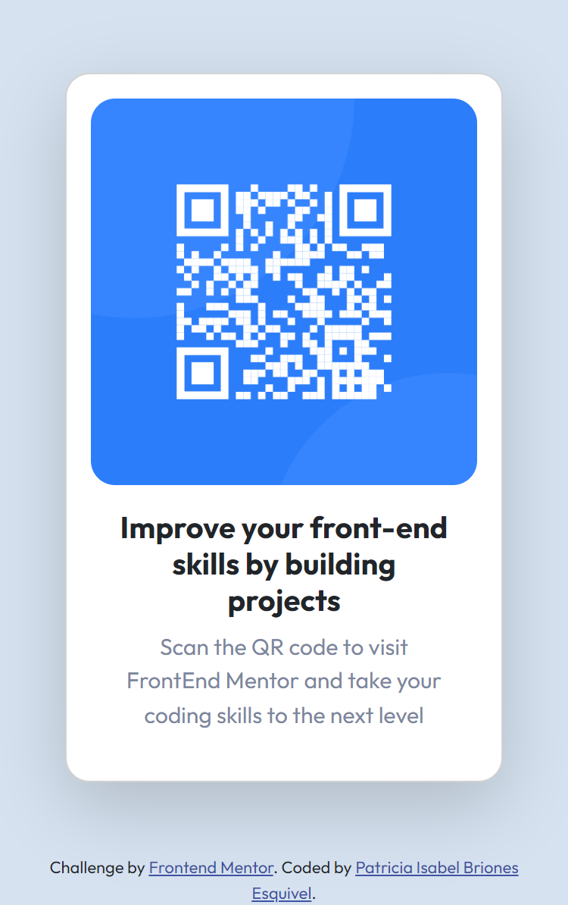
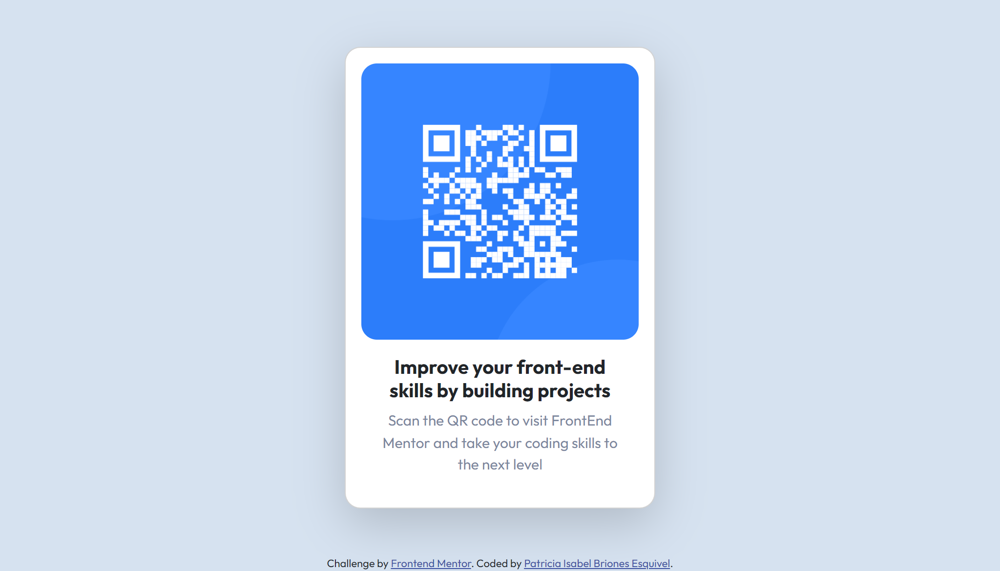

# Frontend Mentor - QR code component solution

This is a solution to the [QR code component challenge on Frontend Mentor](https://www.frontendmentor.io/challenges/qr-code-component-iux_sIO_H). Frontend Mentor challenges help you improve your coding skills by building realistic projects. 

## Table of contents

- [Overview](#overview)
  - [Screenshots](#screenshots)
- [My process](#my-process)
  - [Built with](#built-with)

## Overview

### Screenshots
Mobile

Desktop

## My process

### Built with

- Semantic HTML5 markup
- CSS custom properties
- Flexbox
- CSS Grid
- [Bootstrap](https://getbootstrap.com) - For styles

# Front-end Style Guide

## Layout

The designs were created to the following widths:

- Mobile: 375px
- Desktop: 1440px

## Colors

- White: hsl(0, 0%, 100%)
- Light gray: hsl(212, 45%, 89%)
- Grayish blue: hsl(220, 15%, 55%)
- Dark blue: hsl(218, 44%, 22%)

## Typography

### Body Copy

- Font size (paragraph): 15px

### Font

- Family: [Outfit](https://fonts.google.com/specimen/Outfit)
- Weights: 400, 700